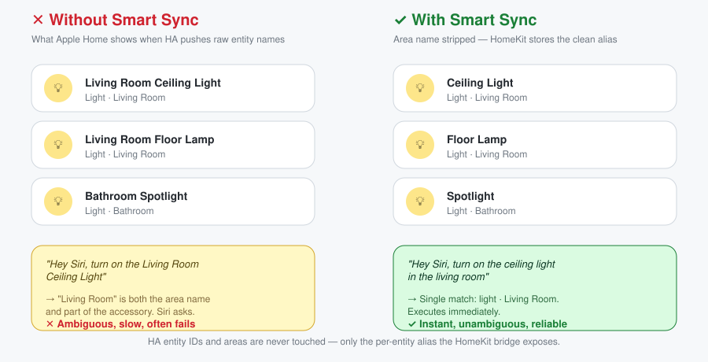
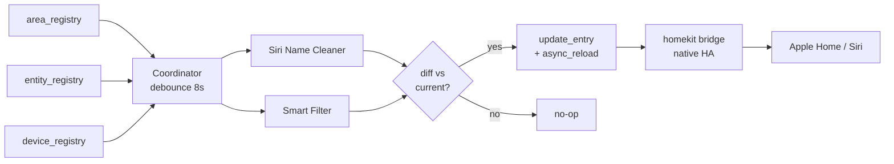

<h1 align="center">HomeKit Smart Sync</h1>

<p align="center">
  <em>Make Home Assistant the single source of truth for your Apple Home — without renaming every device twice.</em>
</p>

<p align="center">
  <a href="https://github.com/ClaraVnk/homekit-smart-sync/actions/workflows/validate.yml"></a>
  <a href="https://github.com/ClaraVnk/homekit-smart-sync/actions/workflows/test.yml"></a>
  <a href="https://github.com/ClaraVnk/homekit-smart-sync/actions/workflows/lint.yml"></a>
  <br>
  <a href="https://hacs.xyz/"></a>
  <a href="https://www.home-assistant.io/"></a>
  <a href="https://www.python.org/"></a>
  <a href="LICENSE"></a>
  <a href="https://github.com/astral-sh/ruff"></a>
  <a href="https://github.com/ClaraVnk/homekit-smart-sync/stargazers"></a>
</p>

<p align="center">
  
</p>

---

## Why?

If you use Home Assistant **and** Apple Home, you've lived this:

- You rename `light.living_room_ceiling` to *"Ceiling Light"* in HA and assign it to the *Living Room* area.
- You expose it to HomeKit. Apple Home picks it up as **"Ceiling Light"** but in the wrong room.
- You move it to *Living Room* on your iPhone. Siri now responds to *"turn on the ceiling light"* — great.
- Six months later you tweak the entity in HA. Apple Home shows **"Living Room Ceiling Light"** again. Siri now stumbles on *"turn on the living room ceiling light in the living room"* — ambiguous, slow.

**HomeKit Smart Sync** ends that loop. HA is the source of truth; Apple Home and Siri follow.

---

## What it does

### 🎯 Siri Name Cleaner
Strips redundant area names from entity aliases pushed to HomeKit.
`Living Room Ceiling Light` in area *Living Room* → just **Ceiling Light**.
Idempotent, accent-insensitive, case-insensitive, multi-word areas supported.

### 🏠 Auto-Room Persistent Mapping
Watches `area_registry` and `entity_registry`. When you rename an area or move
an entity in HA, Smart Sync recomputes the overrides and pushes them to the
HomeKit bridge — no manual sync, no restart.

### 🎙️ Smart Filter for Voice
Excludes diagnostic entities, secondary battery sensors, power/energy/voltage/current
sensors and other noise that pollutes Apple Home and slows Siri.
Battery sensors with a single voice-actionable sibling on the same device are
re-attached via `linked_battery_sensor` — Apple's *Low Battery* notification
keeps working.

---

## How it works

Smart Sync does **not** fork or replace the official `homekit` integration.
It sits in front of it as an orchestrator: it observes HA's registries,
computes the right `entity_config` + `filter` payload, and pushes it into the
bridge's options. The HAP bridge is unchanged.



Three properties keep the system stable:

| Invariant | Mechanism |
|---|---|
| No reload loops | `clean_entity_name` is idempotent; `_options_equal` short-circuits when nothing changed |
| No data loss on uninstall | Original bridge options are snapshotted on first sync and restored on `async_unload_entry` |
| User's manual rules preserved | Filter overlays use **union** semantics (we never narrow excludes the user set by hand) |

---

## Installation

### Via HACS *(recommended)*

1. In HACS: **Integrations → ⋮ → Custom repositories**
2. Add `https://github.com/ClaraVnk/homekit-smart-sync` as type **Integration**
3. Install, restart Home Assistant
4. **Settings → Devices & Services → Add Integration → HomeKit Smart Sync**
5. Pick the bridge(s) Smart Sync should manage

<!-- Replace with real capture once available — see SHOOT_LIST.md -->
<!-- <p align="center"></p> -->

### Manual

Drop `custom_components/homekit_smart_sync/` into your HA config directory's
`custom_components/` folder, restart, then proceed from step 4 above.

---

## Configuration

The config flow asks one thing: **which HomeKit bridges** Smart Sync should manage.
Accessory-mode bridges are filtered out automatically (Smart Sync has nothing
to add when only one accessory is exposed).

<!-- Replace with real capture once available — see SHOOT_LIST.md -->
<!-- <p align="center"></p> -->
<!-- <p align="center"></p> -->

Two toggles you'll see:

- **Enable Siri Name Cleaner** — turn off if you want only the filter
- **Enable Smart Filter for Voice** — turn off if you want only the renamer

After setup, use **Configure** on the integration card to add extra excluded
domains or change which bridges are managed.

---

## ⚠️ Heads-up: the "Not Responding" flash

Every time Smart Sync pushes an update, the HomeKit integration reloads its
HAP server. For 1–3 seconds, Apple Home may show your accessories as
*Not Responding* while the iPhone reconnects.

Smart Sync applies an **8-second debounce** to coalesce bursts (rename five
entities in a row → one reload, not five). This is a deliberate trade-off:
lower the debounce in `custom_components/homekit_smart_sync/const.py` if you
want snappier reaction at the cost of more flashes.

---

## Architecture in detail

| Module | Responsibility | HA imports? |
|---|---|---|
| `naming.py` | Siri Name Cleaner algorithm | ❌ pure |
| `filtering.py` | Voice-filter rules + linked-battery resolution | ❌ pure |
| `registry_resolver.py` | Entity ⇄ area ⇄ device resolution | ✅ |
| `coordinator.py` | Debouncer, snapshot/restore, diff, push | ✅ |
| `config_flow.py` | UI setup + options flow | ✅ |
| `__init__.py` | Wiring | ✅ |

The pure modules are unit-tested with **zero Home Assistant dependency** via
an `importlib` shim in `tests/conftest.py`. Integration tests live under
`tests/integration/` and exercise the full registry → coordinator → bridge
options pipeline against a real HA runtime
(`pytest-homeassistant-custom-component`).

---

## Limitations

- **Snapshot schema drift.** Snapshots taken on HA *vX* are restored as-is on
  HA *vY*. If the `homekit` integration ever changes its options schema between
  versions, your restore may be slightly stale. Mitigation: reconfigure the
  bridge after a major HA upgrade.
- **`entry.options["filter"]` shape.** The schema is observable but not
  publicly contracted as stable. Smart Sync handles missing keys defensively;
  release notes for `homekit` are checked at each major HA bump.
- **Single-accessory mode is not managed.** Accessory-mode bridges expose one
  entity — there's no naming or filtering to coalesce.

---

## Roadmap

- [x] Integration tests with `pytest-homeassistant-custom-component`
- [ ] Optional translation of cleaned aliases (multi-language households)
- [ ] Linked `humidity` / `temperature` sensors for climate entities
- [ ] Custom rename rules per entity (UI editor)
- [ ] Repairs flow for ambiguous battery links
- [ ] Per-bridge enable/disable in options flow

---

## Development

```bash
# Set up a venv
python3 -m venv .venv
source .venv/bin/activate

# Unit tests (no Home Assistant required — fast)
pip install -r requirements_test.txt
pytest tests/ --ignore=tests/integration -v

# Integration tests (pulls in Home Assistant — slower)
pip install -r requirements_integration.txt
pytest tests/integration/ -v

# Lint
pip install ruff
ruff check .
ruff format --check .
```

The CI on every push/PR runs hassfest, HACS validation, ruff, and pytest on
Python 3.12 and 3.13.

---

## License

[MIT](LICENSE) — © 2026 Clara Vnk
